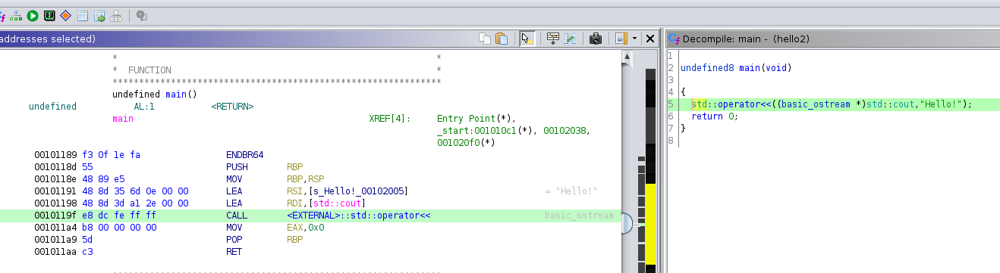

# c++産の実行ファイル分析その2
## [ソースコード](hello2.cpp)
- Hello!と出力するだけ
- 今回はバイナリを眺めるので、より理解しやすくするために前回のソースコードを少し修正した
```
$ cat hello2.cpp 
#include<iostream>

int main()
{
	std::cout << "Hello!";
	return 0;
}

$ diff hello2.cpp ../hello1/hello.cpp 
5c5
< 	std::cout << "Hello!";
---
> 	std::cout << "Hello!" << std::endl;
```
---
## 観察する実行ファイルを生成
```
$ g++ hello2.cpp -o hello2
```
---
## c++で見かける<<演算子について
- c++は演算子も再定義できる
- `<<` 演算子はデフォルトでは他の言語でもあるような左シフト演算であるが、stream系のクラスではstream出力の演算子として再定義されているらしい
  - todo: 定義場所を確認
  - todo: ios,istream,ostream,streambufらへんの関係を整理

---
## << 演算子付近のバイナリを眺める
- Ghidraで開いてみた
 

- アセンブリの方を見ると、どうやら`<<`演算子は`std::operator<<` という関数になっているようだ
- std::operator<<の第一引数にstd::coutの関数ポインタ、第二引数に"Hello!"の文字列を指定している
- ちなみに"Hello!"はcの文字列と同じくchar型の配列だった